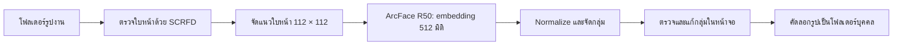

# Face Sorter: ระบบจัดรูปงานตามบุคคล

รายงานรุ่นผลิตภัณฑ์ วันที่ 3 ตุลาคม 2026 สำหรับโครงงานมหาวิทยาลัยกำหนดส่ง 7 ตุลาคม 2026

## 1. ที่มาและวัตถุประสงค์

กิจกรรมหนึ่งงานมีรูปจำนวนมาก ผู้เข้าร่วมต้องเปิดดูทีละรูปเพื่อหารูปของตัวเอง รูปหมู่มีหลายคน จึงไม่ควรถูกจัดไว้กับคนเดียว ระบบนี้ช่วยค้นหาใบหน้า จัดกลุ่มใบหน้าที่คล้ายกัน แล้วคัดลอกรูปต้นฉบับไปยังโฟลเดอร์ของแต่ละบุคคล พร้อมหน้าจอให้ตรวจแก้ผลก่อนส่งออก

ผู้ใช้แจ้งวันที่ 3 ตุลาคมว่าอาจารย์อนุญาตใช้ไลบรารีและโมเดลสำเร็จรูป และต้องการผลิตภัณฑ์พร้อมอธิบายหลักการ ข้อกำหนดเดิมที่ต้องฝึก embedding จากศูนย์จึงถูกยกเลิกสำหรับงานหลัก รุ่นนี้ **ใช้ pretrained SCRFD และ pretrained ArcFace R50** ไม่ได้อ้างว่าฝึกโมเดลทั้งสองเอง ผล MobileFaceNet ที่เคยทดลองเก็บไว้เป็นประวัติ ไม่ได้ใช้ใน pipeline รุ่นผลิตภัณฑ์

## 2. ขอบเขตและการใช้งาน

ผู้ใช้เลือกโฟลเดอร์รูปในเครื่อง โปรแกรมรองรับ JPEG, PNG, HEIC และชนิดที่ระบุใน image_io.py เลือกเปิดชุดผลลัพธ์เดิมได้ ดูภาพใบหน้าและรูปงานของแต่ละกลุ่ม ตั้งชื่อบุคคล รวมกลุ่ม แยกบางใบหน้าเป็นกลุ่มใหม่ ย้ายกลับไปกลุ่มที่ยังไม่ทราบ และย้อนการแก้ไขล่าสุดได้

การตั้งชื่อเป็นการกระทำของผู้ใช้ โปรแกรมไม่ได้ค้นชื่อจริงของบุคคลจากอินเทอร์เน็ตและไม่เชื่อมฐานข้อมูลระบุตัวตน รูปงานและข้อมูลใบหน้าถูกประมวลผลในเครื่อง ไม่มีขั้นตอนส่งรูปไปบริการภายนอก Streamlit เปิดเฉพาะ 127.0.0.1 และปิด usage telemetry ข้อมูลส่วนตัวและผลลัพธ์ไม่ถูกเก็บใน Git

## 3. ภาพรวมระบบ

แยกการคำนวณใบหน้าจากการคัดลอกรูป ทำให้ตรวจผลและเปลี่ยนวิธี clustering โดยไม่ต้องรันโมเดลซ้ำ การทดลองจัดกลุ่มใหม่สร้างชุดผลลัพธ์ใหม่เพื่อรักษาการแก้กลุ่มของชุดเดิม

## 4. หลักการตรวจและเปรียบเทียบใบหน้า

### 4.1 Detection และ alignment

SCRFD เป็นโมเดลตรวจตำแหน่งใบหน้า ระบบเรียกผ่าน InsightFace และ ONNX Runtime โดยอ่าน bounding box, detection score และจุดสำคัญ 5 จุดที่ตา จมูก และมุมปาก แล้วใช้จุดเหล่านี้จัดแนวให้ได้ภาพใบหน้า 112 × 112 พิกเซล [งานวิจัย SCRFD](https://arxiv.org/abs/2105.04714)

อ่านทิศทางรูปจาก EXIF ก่อนตรวจ รูปขนาดใหญ่ลดด้านยาวเหลือไม่เกิน 2,000 พิกเซลสำหรับตรวจ และแปลงพิกัดกลับเพื่อ crop จากภาพต้นฉบับ ค่าเริ่มต้น detection score ≥ 0.5 และขนาดใบหน้าที่เล็กที่สุด ≥ 40 พิกเซล บันทึกค่าความเบลอไว้แต่ไม่ได้ใช้ตัดออกในรุ่นนี้ เพื่อรักษาโอกาสพบคนที่อยู่ไกล

### 4.2 Embedding และ ArcFace

โมเดลสำเร็จรูป w600k_r50.onnx สร้างเวกเตอร์ 512 มิติเป็นข้อมูลแทนใบหน้า โดย ArcFace เป็นวิธีฝึกที่เพิ่ม angular margin ให้แยกข้อมูลคนละบุคคลออกจากกัน โครงงานนี้เรียกใช้ผลของโมเดลที่ฝึกมาแล้ว ไม่ได้คำนวณ ArcFace loss หรือปรับน้ำหนักระหว่างจัดรูป [งานวิจัย ArcFace](https://arxiv.org/abs/1801.07698), [InsightFace model zoo](https://github.com/deepinsight/insightface/blob/master/python-package/docs/model_zoo.md)

ปรับความยาวเวกเตอร์ด้วย L2 normalization เป็น u = x / ||x|| แล้วเปรียบเทียบ cosine similarity = u · v ค่าใกล้กันหมายถึงใบหน้ามีข้อมูลที่คล้ายกัน แต่ไม่ใช่ความน่าจะเป็นว่าเป็นคนเดียวกัน เช่น similarity 0.6 ไม่ได้แปลว่าแม่นยำ 60%

## 5. การจัดกลุ่มและการตรวจแก้

ระบบรองรับ HDBSCAN, DBSCAN และ Agglomerative clustering ชุด day3_ready ใช้ DBSCAN กับ cosine distance eps = 0.4, min_samples = 2 และปิด noise rescue ค่าเหล่านี้เป็นค่าที่ทดลองเพื่อสร้างชุดสำหรับตรวจด้วยผู้ใช้ ยังไม่ได้เลือกจากชุดข้อมูลที่ติดป้ายกำกับ ห้ามเรียกว่าเป็นค่าที่แม่นยำที่สุด

DBSCAN รวมจุดที่เชื่อมกันผ่านเพื่อนบ้านในระยะที่กำหนด และแยกจุดที่มีเพื่อนบ้านไม่พอเป็น noise วิธีนี้ไม่ต้องระบุจำนวนคนล่วงหน้า แต่การเชื่อมต่อผ่านจุดกลางอาจรวมคนละคน ส่วน HDBSCAN พิจารณาความหนาแน่นหลายระดับและรองรับ noise เช่นกัน [เอกสาร DBSCAN](https://scikit-learn.org/stable/modules/generated/sklearn.cluster.DBSCAN.html), [เอกสาร HDBSCAN](https://scikit-learn.org/stable/modules/generated/sklearn.cluster.HDBSCAN.html)

เพิ่มกติกาช่วยตรวจความขัดแย้งในรูปเดียวกัน: กลุ่มอัตโนมัติที่มีหลายใบหน้าในรูปเดียวกันจะถูกแบ่งเป็นกลุ่มย่อย โดยแต่ละกลุ่มรับได้ไม่เกินหนึ่งใบหน้าต่อรูป และต้องคล้ายกับศูนย์กลางกลุ่มพอ หากเหลือใบหน้าเดี่ยวจะกลับไป Unknown กติกานี้เหมาะกับรูปงานทั่วไป แต่มีข้อยกเว้น เช่น ภาพรวมหลายช่อง กระจก หรือคนเดียวปรากฏหลายครั้ง และไม่ได้รับประกันว่ากลุ่มที่เหลือเป็นคนเดียวกันทั้งหมด

ผู้ใช้ตรวจภาพใบหน้า ตั้งชื่อ รวมกลุ่มที่แตก และย้ายใบหน้าที่รวมผิด การแก้ไขเก็บเป็น overrides แยกจาก assignments อัตโนมัติ พร้อมเลข revision และสถานะก่อนแก้ไขล่าสุด การแก้โดยผู้ใช้มีผลเหนือกติกาอัตโนมัติ

## 6. การส่งออกและการป้องกันข้อมูล

รวบรวมกลุ่มของใบหน้าในแต่ละรูปเป็นเซต หากรูปหนึ่งมีคน A และ B จะคัดลอกไปทั้งสองโฟลเดอร์ แต่ถ้ามีหลายใบหน้าที่อยู่กลุ่มเดียวกันจะไม่คัดลอกซ้ำในโฟลเดอร์เดียวกัน รักษาชื่อไฟล์ หากชนกันจากคนละโฟลเดอร์ต้นทางจะเติม hash สั้น

Unknown คือใบหน้าที่จัดกลุ่มไม่ได้ หรือรูปที่ใบหน้าถูกคัดออกทั้งหมด No_Face คือรูปที่ตัวตรวจไม่พบใบหน้า ไฟล์ที่อ่านไม่ได้บันทึกไว้และข้าม การส่งออกเก็บ manifest.csv, summary.json และ export_info.json ซึ่งระบุชุดรูปและ revision ที่ใช้

ป้องกันการส่งออกเข้าโฟลเดอร์ต้นฉบับและการเขียนทับโฟลเดอร์ปลายทางที่มีข้อมูล ตรวจชื่อบุคคลไม่ให้เป็น path และห้ามชื่อซ้ำ คำนวณขนาดทุกสำเนาที่จะคัดลอกแล้วตรวจพื้นที่ว่างพร้อมเผื่อ 512 MiB ก่อนเริ่ม งานปัจจุบันเลือกส่งออกบางคนได้เพราะรูปหมู่ทำให้จำนวนสำเนามากกว่ารูปต้นฉบับ

## 7. ผลรันจริงและการทดสอบ

ผลนี้เป็นสถิติการประมวลผล **ยังไม่ใช่ผลวัดความแม่นยำในการจำบุคคล**

| รายการ | ผล |
|---|---:|
| รูปต้นฉบับ day 3 | 1,045 |
| ใบหน้าที่ผ่านเกณฑ์ | 3,917 |
| รูปที่ไม่พบใบหน้า | 40 |
| รูปอ่านไม่ได้ | 0 |
| เวลารันครั้งแรก ตรวจ → embedding → HDBSCAN | 233.98 วินาที |
| กลุ่มในชุด day3_ready (DBSCAN + กติกาแยกความขัดแย้ง) | 201 |
| ใบหน้าที่ยังไม่มีกลุ่มใน day3_ready | 652 |
| สำเนาที่วางแผนส่งออกทั้งชุด | 3,638 |
| พื้นที่ประมาณสำหรับสำเนาทั้งชุด | 14.15 GiB |

เวลา 233.98 วินาทีเป็นเวลาของการรันครั้งแรกแบบ HDBSCAN ไม่รวมเวลาลอง DBSCAN และการแก้กลุ่ม ไม่ใช่เวลาส่งออกสำเนาทั้งชุด จำนวน 201 กลุ่มยังไม่ใช่จำนวนคนจริง

หลักฐาน: outputs/projects/day3_product/summary.json, outputs/projects/day3_ready/summary.json และ outputs/logs/product_ready_validation.json ตรวจ embedding finite และ normalized และ face ID ไม่ซ้ำใน outputs/logs/product_integrity.json

Unit tests 13 รายการผ่าน ครอบคลุมรูปหลายคนและการคัดลอกไม่ซ้ำ ชื่อไฟล์ชนกัน Unknown/No_Face การรวม/แยก/ย้อนกลุ่ม การเลือกส่งออกบางคน การป้องกัน path และดิสก์ไม่พอ รวมถึงการแยกกลุ่มอัตโนมัติที่มีหลายใบหน้าจากรูปเดียวกัน ผลอยู่ใน outputs/logs/product_unit_tests.log ทดสอบ Streamlit ด้วย AppTest และตรวจหน้าจอจริงในเครื่อง การส่งออกตัวอย่างจากข้อมูลจริงตรวจ SHA-256 ของสำเนาเทียบต้นฉบับผ่าน

## 8. ข้อจำกัดและงานต่อ

ยังไม่มีคำตอบอ้างอิงที่มนุษย์ตรวจครบ จึงยังไม่มี accuracy, precision, recall หรือจำนวนบุคคลที่ยืนยัน ผลอาจรวมคนละคนหรือแยกคนเดียวกันเป็นหลายกลุ่ม โดยเฉพาะหน้าเบลอ เล็ก หันข้าง แสงน้อย หรือคนหน้าคล้าย การตรวจด้วยผู้ใช้เป็นส่วนหนึ่งของขั้นตอนใช้งาน

งานประเมินถัดไปควรให้ผู้ใช้ติดป้ายกำกับตัวอย่าง แล้วแยกข้อมูลที่ใช้ปรับค่าออกจากข้อมูลรายงานผล วัด pairwise precision/recall และ photo-level precision/recall ของโฟลเดอร์ พร้อมแสดงตัวอย่างรวมผิดและแยกผิด ไม่ใช้แค่จำนวนกลุ่มลดลงเป็นหลักฐานว่าดีขึ้น

โมเดลสำเร็จรูป InsightFace มีสิทธิ์ non-commercial research แยกจาก MIT ของโค้ด เหมาะกับขอบเขตโครงงานนี้ การนำไปใช้เชิงพาณิชย์ต้องตรวจสิทธิ์น้ำหนักโมเดล [เงื่อนไข InsightFace](https://github.com/deepinsight/insightface/blob/master/python-package/README.md#license)

งานเสริมคือค้นหารูปด้วยเซลฟีและบรรจุเป็นแอปติดตั้งง่าย รุ่นปัจจุบันยังไม่มีสองความสามารถนี้

## 9. วิธีสาธิต

เปิด `เปิดโปรแกรม.command` แล้วเข้า http://127.0.0.1:8501 เลือก day3_ready → เปิดกลุ่ม → ดูใบหน้าและรูปงาน → ตั้งชื่อหรือแก้กลุ่ม → เลือกส่งออกบางคนไปโฟลเดอร์ใหม่ เมื่อส่งออกทั้งชุดต้องมีพื้นที่พอหรือใช้ไดรฟ์ภายนอก

## ภาคผนวก

Python 3.11, InsightFace 0.7.3, ONNX Runtime 1.30, scikit-learn 1.9.1 และ Streamlit 1.64.0 รายการเวอร์ชันเต็มใน requirements.txt ตรวจรุ่นติดตั้งจริงได้จาก environment logs ระบบผลิตภัณฑ์ใช้ ONNX บน CPU ไม่ต้องใช้ GPU สำหรับฝึก ไม่ต้องใช้ CASIA, LFW หรือ checkpoint MobileFaceNet เพื่อเปิดโปรแกรมเมื่อมีโมเดล ONNX พร้อมแล้ว

คำสั่งสร้างชุดรูปใหม่: `.venv/bin/python run_pipeline.py --input /path/to/photos --run-name my_event` หากต้องการคัดลอกรูปทันทีเพิ่ม `--output /path/to/sorted` ข้อมูลที่ใช้ทำ cache เทียบ path/size/mtime และ hash โมเดล ไม่ได้ hash เนื้อหารูปทั้งหมด การเปลี่ยนค่า clustering ในหน้าจอจะสร้างชุดผลลัพธ์ใหม่
